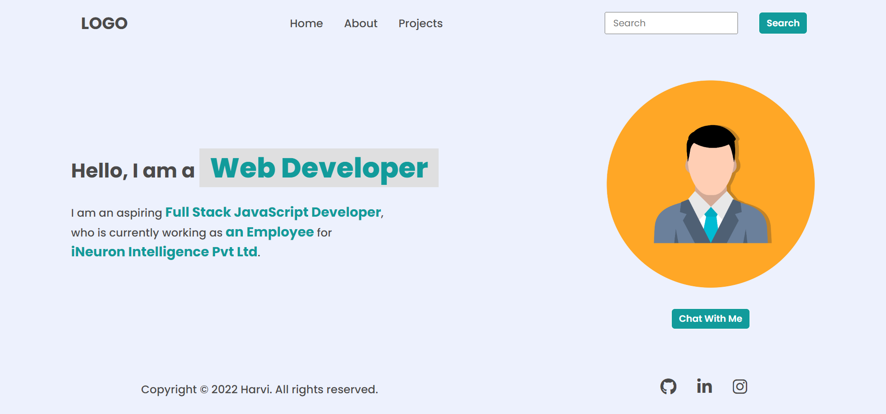

# Project 1

## Task 1

Add Hire me to nav links


Code:

```javascript
let ul = document.querySelector("ul");
let li = document.createElement("li");
li.innerText = "Hire Me";
ul.append(li);
```

## Task2

Change place holder content in search bar


Code:

```javascript
let input = document.querySelector("input")​
input.setAttribute("placeholder","Search My Project")
```

## Task3

Change the description about me.



Code:

```javascript
let spans = document.querySelectorAll("span");
spans = [...spans];
spans[2].innerText = "an Employee";
spans[3].innerText = "iNeuron Intelligence Pvt Ltd";
```

## Task4

Change the image to Hitesh sir photo


Code:

```javascript
let img = document.querySelector("img");
img.setAttribute(
  "src",
  "https://cdn.ineuron.ai/user/profile_pictures/HITESH%20CHOUDHARY.jpg"
);
```

## Task4

Add Support btn next to Chat with me btn


Code:

```javascript
let btnContainer = document.querySelector(".hero-right-section-btns");
let btn = document.createElement("button");
btn.innerText = "Support Me";
btnContainer.append(btn);
```
