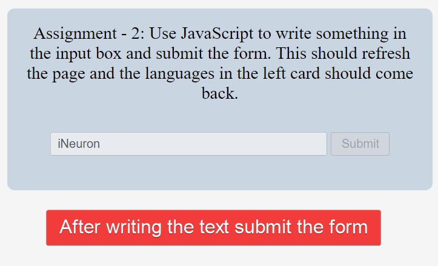

# Project 7

## Task 1

Remove all the tech stack which has 2.0 in it


Code:

```javascript
let techStack = document.querySelectorAll("a");
techStack = [...techStack];
techStack.map((tech) =>
  tech.innerText.includes("2.0") ? (tech.style.display = "none") : null
);
```

## Task 2

Refresh page after writing something in input and click btn



Code:

```javascript
let input = document.querySelector(".main__form-input");
input.disabled = false;
let btn = document.querySelector(".main__form-btn");
btn.disabled = false;
btn.addEventListener("click", () => {
  window.location.href = "/";
});
```
