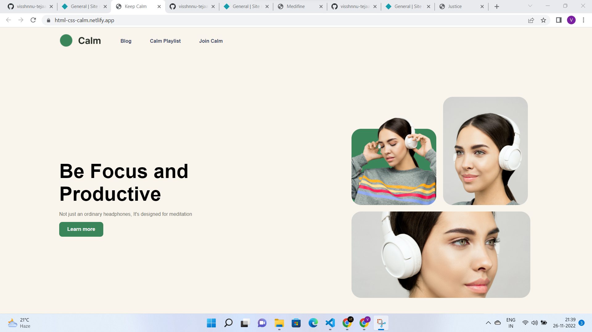

# FSJS2.0 Assessments

### HTML-CSS (SEO Master)

[View Code](https://github.com/visshnnu-tejaa-98/HTML-CSS-seo-master)

[Live Preview](https://html-css-seo-master.netlify.app/)

### HTML-CSS (Crypto Market)

[View Code](https://github.com/visshnnu-tejaa-98/html-css-crypto-market)

[Live Preview](https://html-css-crypto-market.netlify.app)

### HTML-CSS (Fashion Hub)

[View Code](https://github.com/visshnnu-tejaa-98/html-css-fashion-hub)

[Live Preview](https://html-css-fashion-hub.netlify.app)

### HTML-CSS (Calm)

[View Code](https://github.com/visshnnu-tejaa-98/html-css-calm)

[Live Preview](https://html-css-calm.netlify.app/)

### HTML-CSS (Medifine)

[View Code](https://github.com/visshnnu-tejaa-98/html-css-medifine)

[Live Preview](https://html-css-medifine.netlify.app/)

### HTML-CSS (Justice)

[View Code](https://github.com/visshnnu-tejaa-98/html-css-justice)

[Live Preview](https://html-css-justice.netlify.app/)

### HTML-CSS (VS Code Website Clone)

[View Code](https://github.com/visshnnu-tejaa-98/tailwind-vscode-clone)

[Live Preview](https://tailwind-vscode-clone.netlify.app/)

<!-- blank line -->
<figure class="video_container">
  <video controls="true" allowfullscreen="true" poster="path/to/poster_image.png">
    <source src="/assets/7-vs-code.mp4" type="video/mp4">
    <source src="/assets/7-vs-code.mp4" type="video/ogg">
    <source src="/assets/7-vs-code.mp4" type="video/webm">
  </video>
</figure>
<!-- blank line -->
